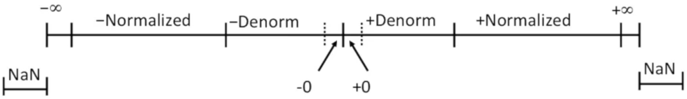

# Lecture 4. Floating Point

## 带有小数的二进制数字

* `1011.101b` 的含义是什么？
* 表示法：
    * 在二进制小数点右边的代表乘上 2 的非负整数位权；而在左边的位代表乘上 2 的负整数位权。
    * 表示有理数的公式： $\sum^{i}_{k =-j}b_{k}\times 2^k$ 。

这个表示法的本质其实和十进制是一个原理。

## 带有小数的二进制数字：案例

```
Value
5 3/4  ---> 101.11
2 7/8  --->  10.111
1 7/16 --->   1.0111
```

数字的计算还是求每一位的加权和。

### 结论

* 对于无符号数字来说，向左移动等于除以 2 ；
* 向右移动等于乘以 2 ；
* 二进制数 `0.11111...b` 无限接近 `1.0` ；
    * 这个数字相当于 $1/2 +1/4+1/8+...+1/2^w$ 而这个级数收敛于 $1$ 。

## 可以被表示的数字

### 限制 #1（精度）

**<u>二进制小数只能精确表示可以写为 $x/2^k$ 的数字，其他的数字产生循环小数的现象</u>** 。

```
Value  
1/3  ---> 0.0101010101[01]...
1/5  ---> 0.001100110011[0011]...
1/10 ---> 0.0001000110011[0011]...
```

### 限制 #2（范围）

二进制小数和整数一样，还是表示的范围还是受限于数据类型的长度。并且，精度和范围不可兼得。

## IEEE 浮点数

### IEEE 标准 754

* 该标准在1985 年颁布并且作为浮点算术的规范标准，在此之前，各家厂商有自己的浮点数实现方式。
* 几乎被所有主流的处理器所支持。

### 充分考量了数值问题

* 对于上溢出，下溢出以及取整有非常好的规范性质；
* 浮点计算很难在硬件上做到很快的速度；

## 浮点表示法

### 数值表示形式

$$
(-1)^{s}\cdot M\cdot 2^E
$$

* 「符号位」 $s$ 决定当前数值是正的还是负的；
* 「有效数字」 $M$ 通常是一个属于 $[1.0, 2.0]$ 的小数值；
* 「指数」 $E$ 是一个以 2 为底数权重；

### 编码方式「MSB」

* `s` 意味着符号位 $s$ ；
* 指数域 `exp` 编码 $E$ （但不意味着 `exp` 等于 $E$ ）；
* 有效数字域 `frac` 编码 $M$ （同样地不意味着相等）。

```
|s|exp...........|frac..........................|
```

## 可选精度

* 单精度浮点： 32 位

    ```
    |s(1)|exp(8)|frac(23)|
    ```

* 双精度浮点： 64 位

    ```
    |s(1)|exp(11)|frac(52)|
    ```

* 拓展精度浮点： 80 位（英特尔独家）

    ```
    |s(1)|exp(15)|frac(63 or 64)|
    ```

## 规格化值（常规数值）

默认或者通用的表示方法被称为规格化的表示方法。其条件是 **<u>当 `exp != 000...0` 并且 `exp != 111...1`</u>** 。以上两种情况是特殊情况。

### 指数部分的编码是一个偏置值： `E = Exp - Bias`

* `Exp` :存储在 `exp field` 区域的，以原码（正数）解读（编码）的位序列；
* $Bias = 2^{k-1} - 1$ ；其中这个 $k$ 是 `Exp` 的长度，比方说单精度是 8 位，那么 $Bias$ 就是 $2^7 - 1 = 127$ 。
    * 单精度： `127` （ Exp：1...254 => E: -127...128 ）。
    * 双精度： `1023` （ Exp： 1...2046 => E: -1022...1023 ）。

这样设计的核心原因之一是在数字的比较上可以有很快的速度。

### 有效数字部分编码为： `1.xxx...x` 

* `xxx...x` ：二进制小数点右边的位，前面的那个 `1` 是隐藏掉的；
* 有效数字的最小值就是 `frac = 000...0` （ $M=1.0$ ）；
* 有效数字的最大值就是 `frac = 111...1` （ $M = 2.0 - \epsilon$ ）；
* 因为编码部分的 `1` 总是存在的，所以不需要进行存储，也就是说我们只需要存储小数的部分，那么就会获得多一位的存储空间。

## 规格化值的编码案例

```
/* Float Value */
float F = 15213.0;

/* Sign */
15213 > 0
=> s = 0

15213(10) ---> 11101101101101(2)
=> 1.1101101101101 * 2^13

/* Significand */
M    = 1101101101101
frac = 11011011011010000000000 (23 bits percision)

/* Exponent */
E = 13
Bias = 127
Exp = E + Bias = 13 + 127 = 140
Exp = 10001100

/* Encoding Form */
|s|exp     |frac                   |
|0|10001100|11011011011010000000000|
```

偏置值可以让计算出来的指数上下浮动，从而产生更加均衡的指数范围。

## 非规格化的值（非常接近 0 的数值）

**<u>非规格化的值存在的目的是为了表示非常靠近 0 的小数值</u>** ，因为规格化的值在有效数字部分永远有个 `1` 存在。

* 条件： `exp = 000...0` ；
* 指数数值： $E = 1 - Bias$ （ 并非 $E = 0 - Bias$ ）；
* 有效数字部分编码为： `0.xxx...x` ；

### 几种情况

* `exp = 000...0` ， `frac = 000...0` ：这种情况表示数值为 `0` ，并且有 `+0` 和 `-0` 的区别。因为符号位有两个取值。
* `exp = 000...0` ， `frac != 000...0` ：这种情况表示非常接近 $0$ 的数值， 并且是最接近 $0$ 的等间距数字。 

## 特殊值（特殊情况）

* 条件： `exp = 111...1` ；
* 情况： `exp = 111...1` 且 `frac = 000...0` ：
    * 当前情况表示的是无穷；
    * 可能由计算溢出导致；
    * 可能是正溢出，也可能是负溢出；
    * 例子： `1.0/0.0` , `1.0/-0.0` 。
* 情况： `exp = 111...1` 且 `frac != 000...0` ：
    * 当前情况表示非数字（ `NaN` ）；
    * 可能由于数学上无法表示当前计算结果的情况导致；
    * 例子： `sqrt(-1)` ；

## 浮点数编码的可视化



## 迷你浮点系统案例

```
|s(1)|exp(4)|frac(3)|
```

* 8 位浮点数表示系统
    * 「符号位」是最重要的表示位，因为符号位确定了数字的正负；
    * 接下来的 4 位是「指数位」，并且我们规定 $Bias$ 为 $7$ ；
    * 接下来的 3 位是「有效数字」；
* 同 IEEE 浮点数系统一样分为四种情况：规格化值，非规格化值，特殊值（ `INF` ， `NaN` ）;

```
/* Normalized Value */
s exp  frac  E   Value
0 0111 010   0   10/8 * 1 = 5/4
0 1110 111   7   (7/8 + 8/8) * 128 = 240
/* Careful: the frac part is leading by 1 */
/* E = Exp - Bias */
/* E = 14 - 7 = 7 */

/* Denormalized Value */
s exp  frac  E   Value
0 0000 000   -6  0
0 0000 010   -6  1/4 * 1/64 = 2/512
/* frac part is leading by 0 */
/* E = 1 - Bias(7) */

/* Special Value */
s exp  frac  E   Value
0 1111 000   /   INFINITY
0 1111 101   /   NaN
```

现在可以看出， `exp` 在表示数字的情况下不可能是全是 `1` 的模式。

## IEEE 浮点编码的特殊性质

### 浮点编码的零等于整数的零

```
/* Denormalized Value */
s exp  frac  E   Value
0 0000 000   -6  0
```

可以看到在浮点数模型中，所有位都是 `0` 。

### 可以（基本上）使用无符号整数的比较方法

* 必须首先比较符号位；
* 必须将 `-0` 视为 `0` ；
* `NaNs` 的相关问题：
    * 这个位模式可能比所有的值都要大；
    * 比较时应当如何处理；
* 其余情况都是正常的。

## 浮点数的操作：基本规则

### 基本规则

* 首先计算确切的数值结果（假定有无限的位来进行存储）；
* 将其转化成合适的精度，但是这期间可能：
    * 会发生溢出，因为指数过大的问题；
    * **<u>可能会对 `frac` 部分进行「舍入」</u>** ；

## 舍入

在 IEEE 的标准中有 4 种不同的舍入方式：

* 向零舍入： `1.4 -> 1; 1.6 -> 1; -1.5 -> -1` ；
* 向下舍入： `1.4 -> 1; 1.6 -> 1; -1.5 -> -2` ;
* 向上舍入： `1.4 -> 2; 1.6 -> 2; -1.5 -> -2` ;
* **<u>向偶数舍入（实际的的舍入方式）</u>** ： `1.4 -> 1; 2.6 -> 2; -1.5 -> -2` ；

「向偶数舍入」的规则是： **<u>如果当前值小于一半，那么向下舍入；如果超过一半，那么向上舍入；但是如果正好为一半，那么就向最近的偶数舍入</u>** 。

## 向偶数舍入的分析

向偶数舍入是实际的舍入方式，这个规则是基于统计学的，因为当数字正好在中间时，有 50% 的机率增大或者减小，这样在不断舍入的情况下对于数据的影响是最小的。

```
7.8949999 => 49999 < 50000 =>  7.89
7.8950001 => 50001 > 50000 =>  7.90
7.8950000 => 50000 == 50000 => 7.90 /* 0 is even */
7.8850000 => 50000 == 50000 => 7.88 /* 8 is even */
```

## 二进制数字的舍入

### 二进制小数的舍入情况

* 最低位是 `0` 的数字是偶数；
* 当被要舍去的部分的位模式是 `100...0` 的情况下，表示的是 `1/2` 。

### 例子

```
2 3/32 -> 10.00[011] -> 011 < 100 => 10.00
2 3/16 -> 10.00[110] -> 110 > 100 => 10.01
2 7/8  -> 10.11[100] -> 100 = 100 => 11.00
2 5/8  -> 10.10[100] -> 100 = 100 => 10.10
/* If the current bit is 1, add 1 */
/* If the current bit is 0, so be it */
```

## 浮点数字的乘法

$$
(-1)^{s_1}\cdot M_1\cdot 2^{E_1} \times (-1)^{s_2}\cdot M_2\cdot 2^{E_2}
$$

### 确切的计算结果

* 计算结果的符号位： `S1 ^ S2` ；
* 计算结果的有效数字： `M1 * M2` ；
* 计算结果的指数： `E1 + E2` ；

### 对结果进行修饰

* 如果 `M > 2` 则对 `M` 进行右移操作，并且增加 `E` ；
* 如果 `E` 超过表示的范围，则产生溢出（无穷大）；
* 将 `M` 舍入到 `frac` 能表示的范围内。

## 浮点数字的加法

基本规则就是 **<u>先将小数点对齐，然后相加，再对数字进行规格化</u>** 。

## 浮点数加法的数学性质

### 和其他的阿贝尔群的对比

* 是否是个闭阿贝尔群？ - 是的，但是可能会产生无穷和 `NaN` ;
* 是否遵循啊交换律？ - 是的；
* 是否遵循结合律？ - **<u>不是，浮点数的计算不遵循结合律</u>** ，因为浮点数的加法涉及无穷大和舍入的问题；
* 每个元素是否都有加法逆元？ - 基本上是，但是不包括无穷和 `NaN` ；

### 单调性

* `a >= b => a + c > b + c` 是否成立？ - 基本上是，但是还是无穷和 `NaN` 的问题。

## 浮点数乘法的数学性质

结合律还是不能使用。

## C 语言中的浮点数

在整数的无符号和有符号之间转换的时候，转换函数从来没有改变内存中存储的位序列；改变的只是如何解释那些位的方式，从而得到不同的数值。也就是说，数值的变化仅仅是因为我们使用了不同的编码方式进行解读而已。

但是， **<u>如果在单精度浮点数，整数和双精度浮点数之间进行转换时，位模式会发生变化</u>** 。

* `double/float -> int` ：首先截掉浮点数的小数部分，只留下整数的部分；也就是说，如果将 `float` 转换为 `int` ，那么我们将会使用 32 位来表示 23 位的浮点有效数字部分。但是双精度浮点有 52 位有效数字，这个长度有可能不能放进 32 位的整数中，故我们需要进行向零舍入。

    当浮点数是 `INF` 或者 `NaN` 的情况下进行转换是未定义行为。

* `int -> double` ：精确转换，在 `int` 长度小于 53 位的情况下。

* `int -> float` ：需要进行舍入。

## 浮点数课堂作业

```C
int x = ...;
float f = ...;
double d = ...;

x == (int)(float)x; /* FALSE */
/* Since int(32)->float(23) needs to truncate and round  */
x == (int)(double)x; /* TRUE */
/* Since double has 52 bits for frac */
f == (float)(double)f; /* TRUE */
/* double has more bits than float */
d == (double)(float)f; /* FALSE */
/* the frac part may be truncated */
f == -(-f); /* TRUE */
/* Just need to change the sign bit */
2/3 == 2/3.0; /* FALSE */
/* 2/3 is 0 but 2/3.0 is 0.66[6]... */
d < 0.0 => ((d * 2) < 0.0); /* TRUE */
d * d >= 0.0; /* TRUE */
d + f - d == f /* FASLE */
```

**<u>浮点数不是实数，但是有很强的可预测性，并且不满足结合律</u>** 。